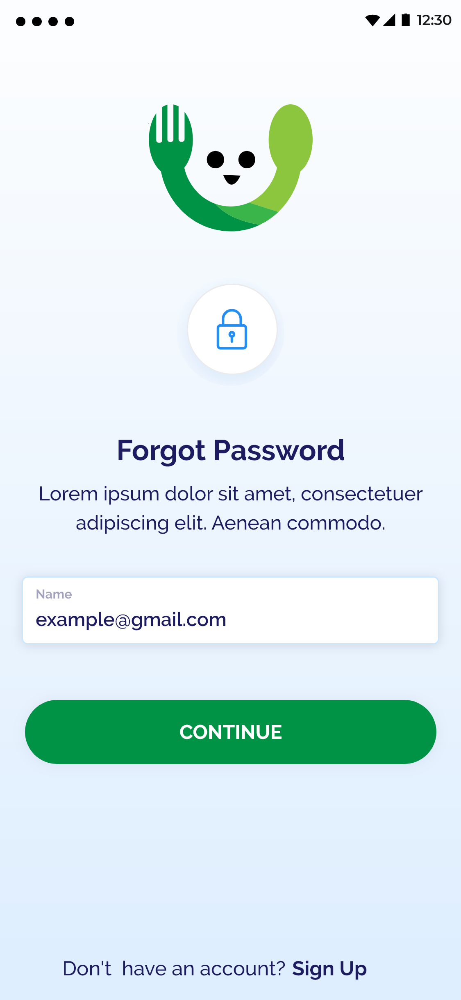
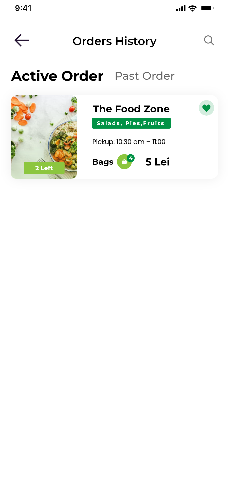

# FudiGudi - Food Delivery and pick and drop service

FudieGudi is a foof pick app. It's main goal is to reduce food wastage.

https://user-images.githubusercontent.com/60160952/149606716-cb1a330c-4504-45d3-a534-851ced2b5045.mp4

    
    
    
    
    
    
    
    
    
    
    
    
    
    
    
    
    
    
    
    
    

## Getting Started

This project is a starting point for a Flutter application.

A few resources to get you started if this is your first Flutter project:

- [Lab: Write your first Flutter app](https://flutter.dev/docs/get-started/codelab)
- [Cookbook: Useful Flutter samples](https://flutter.dev/docs/cookbook)

For help getting started with Flutter, view our
[online documentation](https://flutter.dev/docs), which offers tutorials,
samples, guidance on mobile development, and a full API reference.
